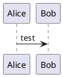
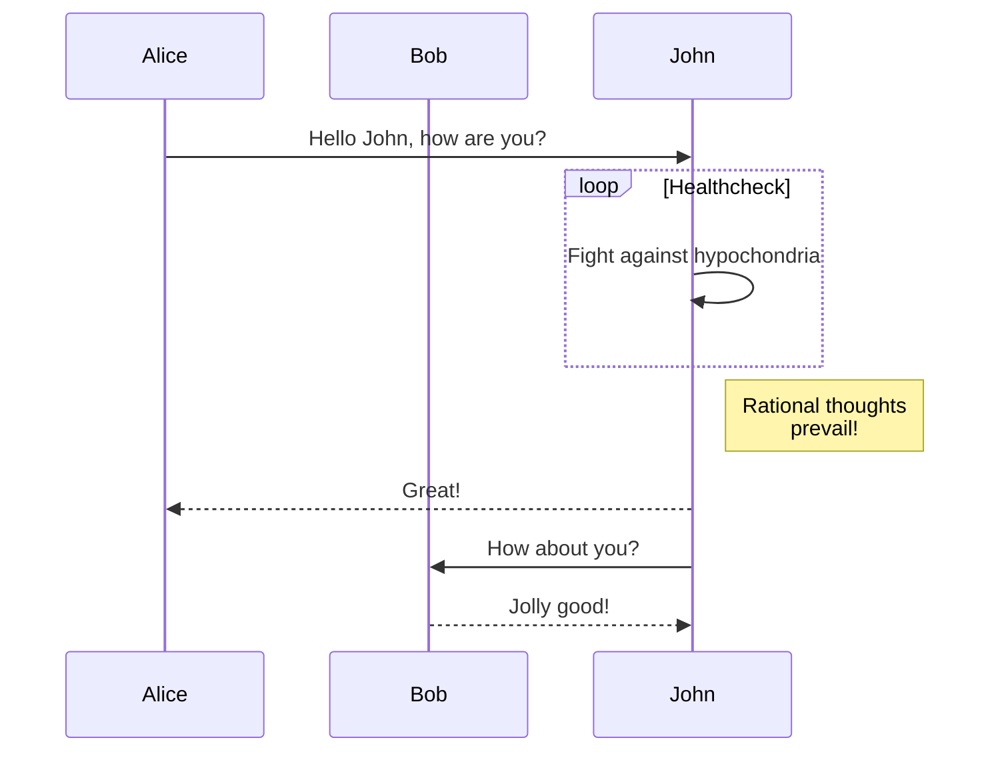
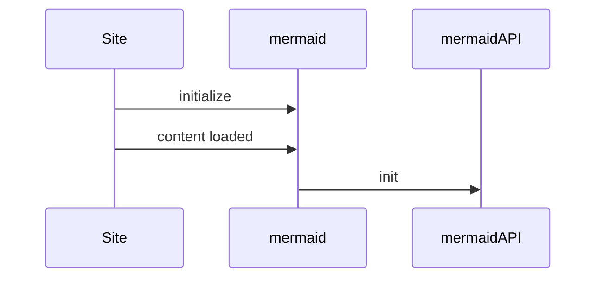
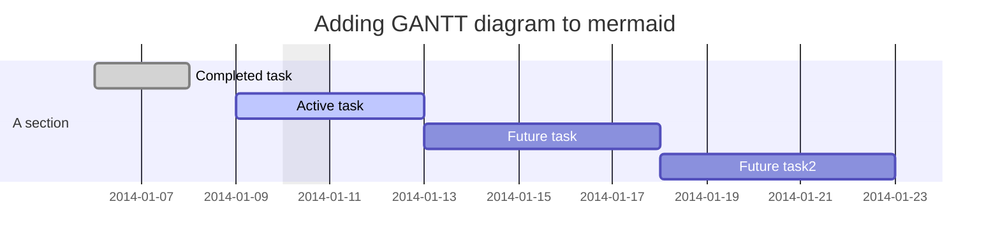
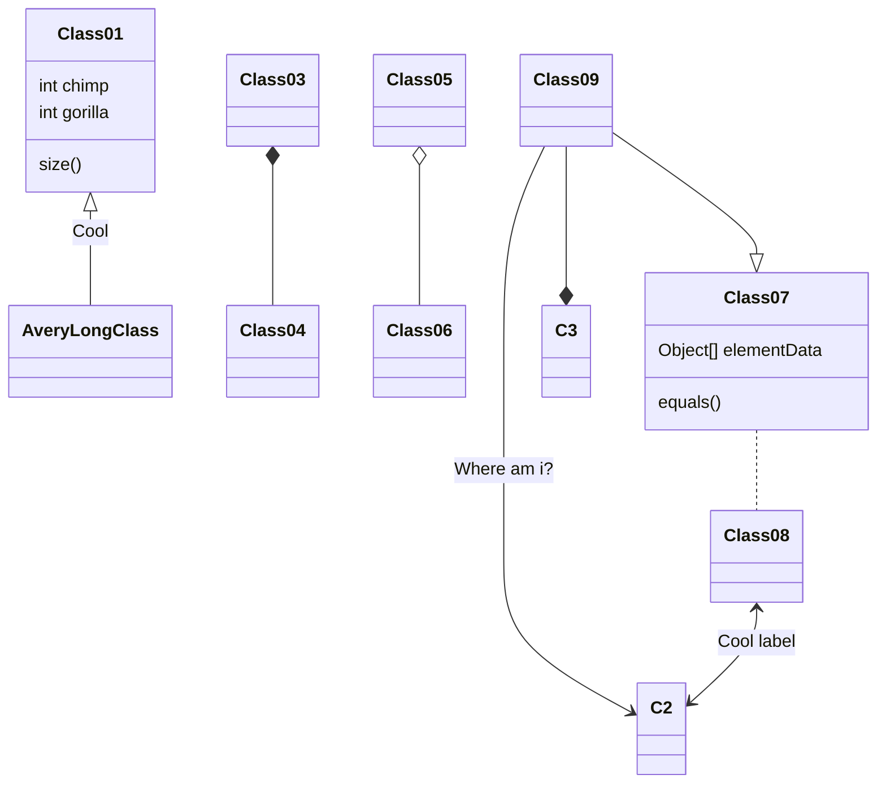
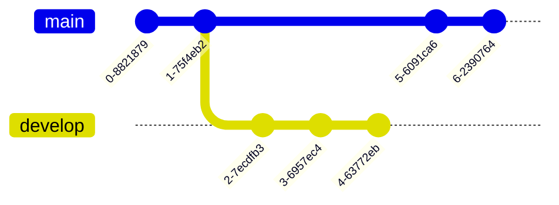
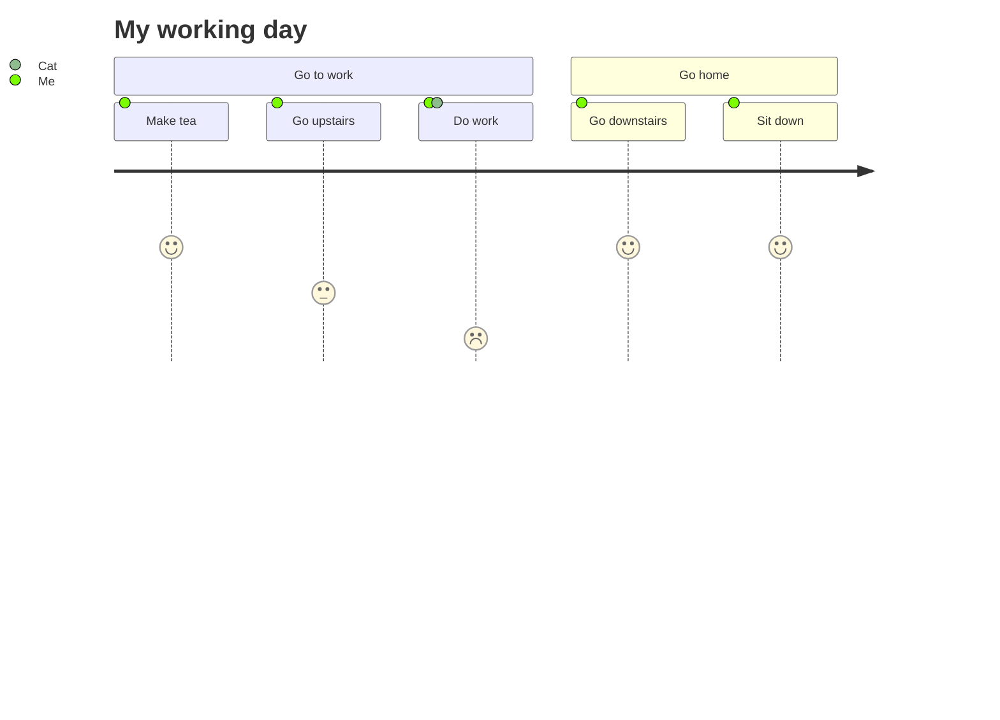

# plantuml-diagram-examples

# 🚀 PlantUML Diagram Examples 🚀

https://github.com/coding-to-music/plantuml-diagram-examples

## Environment Values

```

```

## GitHub

```java
git init
git add .
git remote remove origin
git commit -m "first commit"
git branch -M main
git remote add origin git@github.com:coding-to-music/plantuml-diagram-examples.git
git push -u origin main
```

## Set up Java 8

we are by default using Java 11, need to also install java 8

```
java -version
```

Output

```
openjdk 11.0.17 2022-10-18
OpenJDK Runtime Environment (build 11.0.17+8-post-Ubuntu-1ubuntu220.04)
OpenJDK 64-Bit Server VM (build 11.0.17+8-post-Ubuntu-1ubuntu220.04, mixed mode, sharing)
```

https://github.com/coding-to-music/battlecode2021#install-java-release-8

download java8

move it to /mnt (more space)

```
sudo tar -xzvf jdk1.8.0_351
```

```
export JAVA_HOME="/mnt/volume_nyc1_01/java8/jdk1.8.0_351"
export PATH="$PATH:/mnt/volume_nyc1_01/java8/jdk1.8.0_351/bin:/mnt/volume_nyc1_01/java8/jdk1.8.0_351/jre/bin"
```

```
java -version

```

Output

```
java version "1.8.0_351"
Java(TM) SE Runtime Environment (build 1.8.0_351-b10)
Java HotSpot(TM) 64-Bit Server VM (build 25.351-b10, mixed mode)
```

# Table of Contents of this file

<!-- TOC -->

<!-- /TOC -->

# PlantUML Diagrams

## Installing PlantUML

The PlantUML JAR file can be installed anywhere on your system, as long as you have write access to the location. The most common place to install JAR files is in a directory within your Java installation, such as jre/lib/ext or jdk/lib/ext. However, this is not necessary and you can install the JAR file anywhere you like.

It is important to note that you will need to set the CLASSPATH environment variable to include the location of the JAR file, so that Java can find and use it. You can set the CLASSPATH variable either globally or for the current terminal session. Here's an example of how to set the CLASSPATH variable for the current terminal session:

```
export CLASSPATH=path_to_plantuml.jar
```

Replace path_to_plantuml.jar with the actual path to the JAR file on your system. After setting the CLASSPATH variable, you should be able to run PlantUML from the command line.

```
whereis java
```

```
java: /usr/share/java /usr/java/jdk1.8.0_361/bin/java /usr/java/jdk1.8.0_361/jre/bin/java
```

Download PlantUML

```
wget https://github.com/plantuml/plantuml/releases/download/v1.2023.1/plantuml-1.2023.1.jar
```

```
mv plantuml-1.2023.1.jar /usr/java/jdk1.8.0_361/jre/lib/ext

sudo cp /usr/java/jdk1.8.0_361/jre/lib/ext/plantuml-1.2023.1.jar /usr/java/jdk1.8.0_361/jre/lib/ext/plantuml.jar
```

```
export CLASSPATH=path_to_plantuml.jar

export CLASSPATH=/usr/java/jdk1.8.0_361/jre/lib/ext
```

## Generate .png files from the .puml source

```
java -jar /usr/java/jdk1.8.0_361/jre/lib/ext/plantuml.jar *.puml
```

## PlantUML documentation and links

https://plantuml.com/class-diagram

https://plantuml.com/deployment-diagram

https://github.com/plantuml/plantuml-stdlib

https://the-lum.github.io/puml-themes-gallery/

https://marketplace.visualstudio.com/items?itemName=jebbs.plantuml

https://github.com/qjebbs/vscode-plantuml

https://plantuml.com/skinparam

https://plantuml-documentation.readthedocs.io/en/latest/formatting/color-names.html

https://plantuml-documentation.readthedocs.io/en/latest/formatting/all-skin-params.html

## Actor Component Interface UseCase

| Long form Keyword | Short form Keyword | Long form example    | Short form example | Ref.       |
| ----------------- | ------------------ | -------------------- | ------------------ | ---------- |
| actor             | :a:                | actor actor1         | :actor2:           | Actors     |
| component         | [c]                | component component1 | [component2]       | Components |
| interface         | ()i                | interface interface1 | () "interface2"    | Interfaces |
| usecase           | (u)                | usecase usecase1     | (usecase2)         | Usecases   |

### Create .png file of the overall system diagram

```
java -jar /usr/java/jdk1.8.0_361/jre/lib/ext/plantuml.jar a-system-diagram.puml

java -jar /usr/java/jdk1.8.0_361/jre/lib/ext/plantuml.jar BattleCode-2023-System-Diagram.puml
```

## Hello world for PlantUML



```
⚠️No PlantUML server, specify one with "plantuml.server".

@startuml
Alice -> Bob: test
@enduml
```

## Use PlantUML's command line syntax to include it in your own scripts or documentation tools.

- 1. Create a text file with PlantUML commands, like this example called sequenceDiagram.txt:

```
@startuml
Alice -> Bob: test
@enduml
```

- 2. Run (or have your software call) PlantUML, using sequenceDiagram.txt as input. The output is an image, which either appears in the other software, or is written to an image file on disk.
     For example:

```
java -jar plantuml.jar sequenceDiagram.txt

or

java -jar plantuml.jar -verbose sequenceDiagram.txt
```

This outputs your sequence diagram to a file called sequenceDiagram.png.

# Example Plant UML Diagrams

'BattleCode 2023 System Diagram.png'  
Headquarters-Strategy.png  
RobotPlayer.png  
'runHeadquarters Swim Lanes.png'  
'swim lanes.png'

BigPicture-Sequence-Diagram.png  
'RobotPlayer Horizontal.png'  
'RobotPlayer Vertical.png'  
'RunHeadquarters Vertical.png'

Examples

1activity-branches.png  
1components-groups-databases.png  
1devto-c4-classy-objects.png  
1parallel-synchronization.png  
1while-loop-variables.png  
autonumber-sequence.png  
colors.png  
sequence.png
1activity-variables-loops.png  
1components-json-data.png  
1long-text-action.png  
1several-tests-horizontal.png  
1-work-breakdown-structure-wbs.png  
classes-person-pet.png  
example.png  
vertical.png
1archimate.png  
1creole-salt-fonts-effects.png  
1mindmap-colors.png  
1several-tests-vertical.png  
another-gantt.png  
colors-example.png  
foo.png
1branches-if-nested.png  
1deployment-elements.png  
1mindmap-header-footer.png  
1swim-lanes-activity-diagram-beta.png  
autonumber-sequence-formatted.png  
colors-heatmap.png  
sequenceDiagram.png

# Mermaid Diagram Types

## Flowchart


## Sequence diagram



## sequenceDiagram



## Gantt diagram#



## Class Diagram



## Git graph



## User Journey Diagram




## CarrierStrategy

```
    static void runCarrier(RobotController rc) throws GameActionException {
        if (RobotPlayer.turnCount == 2) {
            Communication.updateHeadquarterInfo(rc);
        }
        if(hqLoc == null) {
            scanHQ(rc);

        if(wellLoc == null) scanWells(rc);
        scanIslands(rc);

        //Collect from well if close and inventory not full
        if(wellLoc != null && rc.canCollectResource(wellLoc, -1)) {
            rc.setIndicatorString("AA rc.collectResource(wellLoc " + wellLoc);
            rc.collectResource(wellLoc, -1);
        }

       //Transfer resource to headquarters
        depositResource(rc, ResourceType.ADAMANTIUM);
        depositResource(rc, ResourceType.MANA);

        if(rc.canTakeAnchor(hqLoc, Anchor.STANDARD)) {
            rc.setIndicatorString("BB takeAnchor " + hqLoc);
            rc.takeAnchor(hqLoc, Anchor.STANDARD);
            anchorMode = true;
        }

        //no resources -> look for well
        if(anchorMode) {
            rc.setIndicatorString("4440 anchorMode ");
            if(islandLoc == null) {
                rc.setIndicatorString("4441 anchorMode && islandLoc == null");
                for (int i = Communication.STARTING_ISLAND_IDX; i < Communication.STARTING_ISLAND_IDX + GameConstants.MAX_NUMBER_ISLANDS; i++) {
                    MapLocation islandNearestLoc = Communication.readIslandLocation(rc, i);
                    if (islandNearestLoc != null) {
                        islandLoc = islandNearestLoc;
                        rc.setIndicatorString("4442 Bring Anchor to " + islandLoc);
                        if (printToConsole || sometimesTrue) {
                            System.out.println(logDetails + " 4442 Anchor mode, moving toward island " + islandLoc );
                        }
                        break;
                    }
                }
            }
            else {
                if (printToConsole || sometimesTrue) {
                    System.out.println(logDetails + " 4444 Bring Anchor to " + islandLoc );
                }
                rc.setIndicatorString("4444 Bring Anchor to " + islandLoc);
                RobotPlayer.moveTowards(rc, islandLoc);
            }

            if(rc.canPlaceAnchor() && rc.senseTeamOccupyingIsland(rc.senseIsland(rc.getLocation())) == Team.NEUTRAL) {
                rc.setIndicatorString("4445 Anchor mode, Placed Anchor " + rc.getLocation());
                rc.placeAnchor();
                anchorMode = false;
                if (printToConsole || sometimesTrue) {
                    System.out.println(logDetails + " 4445 Anchor mode, Placed Anchor " + rc.getLocation() );
                }
            }
        }
        else {
            int total = getTotalResources(rc);
            if(total == 0) {
                //move towards well or search for well
                if(wellLoc == null) {
                    rc.setIndicatorString("HH Moving randomly wellLoc is null ");
                    RobotPlayer.moveRandom(rc);
                    if (printToConsole || sometimesTrue) {
                        System.out.println(logDetails + " HH Not adjacent to a well so moving randomly " );
                    }
                }
                else if(!rc.getLocation().isAdjacentTo(wellLoc)) {
                    rc.setIndicatorString("II Moving toward well at " + wellLoc);
                    RobotPlayer.moveTowards(rc, wellLoc);
                    if (printToConsole || sometimesTrue) {
                        System.out.println(logDetails + " II Not adjacent to a well so moving toward one at " + wellLoc );
                    }
            }
            }
            if(total == GameConstants.CARRIER_CAPACITY) {
                //move towards HQ
                RobotPlayer.moveTowards(rc, hqLoc);
                rc.setIndicatorString("JJ Carrier Capacity move to HQ " + hqLoc);
            }
        }
        Communication.tryWriteMessages(rc);
    }

```

### Additional Carrier functions

```
    static void scanHQ(RobotController rc) throws GameActionException {
        RobotInfo[] robots = rc.senseNearbyRobots();
        for(RobotInfo robot : robots) {
            if(robot.getTeam() == rc.getTeam() && robot.getType() == RobotType.HEADQUARTERS) {
                hqLoc = robot.getLocation();
                break;
            }

    static void scanWells(RobotController rc) throws GameActionException {
        WellInfo[] wells = rc.senseNearbyWells();
        if(wells.length > 0) wellLoc = wells[0].getMapLocation();
    }

    static void depositResource(RobotController rc, ResourceType type) throws GameActionException {
        int amount = rc.getResourceAmount(type);
        if(amount > 0) {
            if(rc.canTransferResource(hqLoc, type, amount)) rc.transferResource(hqLoc, type, amount);
        }
    }

    static int getTotalResources(RobotController rc) {
        return rc.getResourceAmount(ResourceType.ADAMANTIUM)
            + rc.getResourceAmount(ResourceType.MANA)
            + rc.getResourceAmount(ResourceType.ELIXIR);
    }

    static void scanIslands(RobotController rc) throws GameActionException {
        int[] ids = rc.senseNearbyIslands();
        for(int id : ids) {
            if(rc.senseTeamOccupyingIsland(id) == Team.NEUTRAL) {
                MapLocation[] locs = rc.senseNearbyIslandLocations(id);
                if(locs.length > 0) {
                    islandLoc = locs[0];
                    break;
                }
            }
            Communication.updateIslandInfo(rc, id);
        }
    }

```

## Communications

### Communications functions - Being Called

- static void addHeadquarter(RobotController rc) throws GameActionException {
- called by RobotPlayer turnCount 1

- static void updateHeadquarterInfo(RobotController rc) throws GameActionException {
- called by RobotPlayer turnCountd 2

- static void tryWriteMessages(RobotController rc) throws GameActionException {
- called by runCarrier at end of each loop
- called by runLauncher in middle of each loop

- static void updateIslandInfo(RobotController rc, int id) throws GameActionException {
- called by runCarrier at end of scanIslands

- static void clearObsoleteEnemies(RobotController rc) {
- called by runLauncher at startup after finding headquarters

- static void reportEnemy(RobotController rc, MapLocation enemy) {
- called by runLauncher at startup after clearObsoleteEnemies

- private static int locationToInt(RobotController rc, MapLocation m) {
- called by bitPackIslandInfo and addHeadquarter

- private static MapLocation intToLocation(RobotController rc, int m) {
- called by readIslandLocation, updateHeadquarterInfo, clearObsoleteEnemies, getClosestEnemy

- static int bitPackIslandInfo(RobotController rc, int islandId, MapLocation closestLoc) {
- called by updateIslandInfo

- static MapLocation readIslandLocation(RobotController rc, int islandId) {
- called by runCarrier when holding an anchor

## LauncherStrategy

```java
public class LauncherStrategy {
    static void runLauncher(RobotController rc) throws GameActionException {
        // Try to attack someone
        int radius = rc.getType().actionRadiusSquared;
        Team opponent = rc.getTeam().opponent();
        RobotInfo[] enemies = rc.senseNearbyRobots(radius, opponent);
        int lowestHealth = 1000;
        int smallestDistance = 100;
        RobotInfo target = null;
        if (RobotPlayer.turnCount == 2) {
            Communication.updateHeadquarterInfo(rc);
        }
     //   Communication.clearObsoleteEnemies(rc);
        if (enemies.length > 0) {
            for (RobotInfo enemy: enemies){
         //       Communication.reportEnemy(rc, enemy.location);
                int enemyHealth = enemy.getHealth();
                int enemyDistance = enemy.getLocation().distanceSquaredTo(rc.getLocation());
                if (enemyHealth < lowestHealth){
                    target = enemy;
                    lowestHealth = enemyHealth;
                    smallestDistance = enemyDistance;
                }
                else if (enemyHealth == lowestHealth){
                    if (enemyDistance < smallestDistance){
                        target = enemy;
                        smallestDistance = enemyDistance;
                    }
                }
            }
        }
     //   Communication.tryWriteMessages(rc);
        if (target != null){
            if (rc.canAttack(target.getLocation()))
                rc.attack(target.getLocation());
            Pathing.moveTowards(rc, target.getLocation());
        }
        else {
            RobotInfo[] allies = rc.senseNearbyRobots(9, rc.getTeam());
            int lowestID = rc.getID();
            MapLocation leaderPos = null;
            for (RobotInfo ally : allies){
                if (ally.getType() != RobotType.LAUNCHER)
                    continue;
                if (ally.getID() < lowestID){
                    lowestID = ally.getID();
                    leaderPos = ally.getLocation();
                }
            }
            if (leaderPos != null){
                Pathing.moveTowards(rc, leaderPos);
                rc.setIndicatorString("Following " + lowestID);
            }
            else{
                MapLocation center = new MapLocation(rc.getMapWidth()/2, rc.getMapHeight()/2);
                Pathing.moveTowards(rc, center);
                rc.setIndicatorString("I'm the leader!");
            }
        }


        // Also try to move randomly.
        Direction dir = RobotPlayer.directions[RobotPlayer.rng.nextInt(RobotPlayer.directions.length)];
        if (rc.canMove(dir)) {
            rc.move(dir);
        }
    }
```

## OptimalResource

## Pathing

# src files needed and purpose

## Booster

- Need elixir

## Destabilizer

- Need elixir

## Amplifier

- currently building via RobotPlayer

  - fleet of 2 per HQ every 50 turns

- Needed changes

  - Don't move toward enemy, instead move away
  - sense for islands
  - sense for enemies
  - have a launcher that follows to protect
  - write to shared array with locations

- Carrier Changes needed

  - Dump into well to change into Elixir
  - Amplifier will report islands - go to them

- Launcher Changes needed
  - look for inverse headquarters and go there

# 2023 Battlecode Video Lectures

|            | Where   | Time    | Content                          | Link                                                                                                                     |
| ---------- | ------- | ------- | -------------------------------- | ------------------------------------------------------------------------------------------------------------------------ |
| Lecture 1  | YouTube | 0:19:10 | Battlecode 2023 Kickoff          | [Battlecode 2023 Kickoff ](https://www.youtube.com/watch?v=NOlA9z_xz9Y&ab_channel=MITBattlecode)                         |
| Lecture 2  | YouTube | 1:18:20 | Battlecode 2023 Getting Started  | [Battlecode 2023 Getting Started ](https://www.youtube.com/watch?v=zqtE9JaTI7k&ab_channel=MITBattlecode)                 |
| Lecture 3  | YouTube | 0:29:28 | Intro to Git                     | [Battlecode 2023 Intro to Git ](https://www.youtube.com/watch?v=toCy2buudCI&ab_channel=MITBattlecode)                    |
| Lecture 4  | YouTube | 0:51:08 | Intro to Bot Making              | [Battlecode 2023 Intro to Bot Making ](https://www.youtube.com/watch?v=ipSNLNQtVGE&ab_channel=MITBattlecode)             |
| Lecture 5  | YouTube | 1:01:15 | Communication and Pathfinding    | [Battlecode 2023 Communication and Pathfinding ](https://www.youtube.com/watch?v=K_XrupSr8V4&ab_channel=MITBattlecode)   |
| Lecture 6  | Twitch  | 0:17:16 | Macro Strategy / Balance Changes | [Battlecode 2023 Macro Strategy / Balance Changes ](https://www.twitch.tv/videos/1711526894)                             |
| Lecture T1 | Twitch  | 1:46:33 | Sprint 1 Tournament              | [Battlecode 2023 Sprint 1 Tournament ](https://www.twitch.tv/videos/1710551833)                                          |
| Lecture 7  | YouTube | 1:05:37 | Micro Strategy                   | [Battlecode 2023 Lecture 7 Micro Strategy ](https://www.youtube.com/watch?v=DFao1XX7k4g&ab_channel=MITBattlecode)        |
| Lecture 8  | YouTube | 0:25:55 | Bytecode Hacking & Optimization  | [Battlecode 2023 Bytecode Hacking & Optimization ](https://www.youtube.com/watch?v=l5FYOE0SNzc&ab_channel=MITBattlecode) |
| Lecture T2 | Twitch  | 1:46:33 | Sprint 2 Tournament              | [Battlecode 2023 Sprint 2 Tournament ]()                                                                                 |

## Robots - Overview

|                   | Headquarters | Carrier                                                | Launcher | Destabilizer | Booster | Amplifier    |
| ----------------- | ------------ | ------------------------------------------------------ | -------- | ------------ | ------- | ------------ |
| Cost              | N/A          | 50 Ad                                                  | 60 Mn    | 200 Ex       | 150 Ex  | 30 Ad, 30 Mn |
| Cooldown / action | 10           | 8                                                      | 10       | 70           | 140     | N/A          |
| Cooldown / move   | N/A          | $\left\lfloor\left(5+\frac{3m}{8}\right)\right\rfloor$ | 15       | 20           | 25      | 15           |
| Health            | N/A          | 150                                                    | 200      | 300          | 400     | 120          |
| Attack            | 4            | $\left\lfloor\left(\frac{5m}{4}\right)\right\rfloor$   | 30       | 50           | N/A     | N/A          |
| Action radius     | 9            | 9                                                      | 16       | 13           | N/A     | N/A          |
| Vision radius     | 34           | 20                                                     | 20       | 20           | 20      | 34           |
| Bytecode limit    | 20,000       | 12,500                                                 | 10,000   | 10,000       | 10,000  | 10,000       |

# Breakdown of content on videos

# Lecture 1 - Battlecode 2023 Kickoff

|           | Where   | Time    | Content                 | Link                                                                                             |
| --------- | ------- | ------- | ----------------------- | ------------------------------------------------------------------------------------------------ |
| Lecture 1 | YouTube | 0:19:10 | Battlecode 2023 Kickoff | [Battlecode 2023 Kickoff ](https://www.youtube.com/watch?v=NOlA9z_xz9Y&ab_channel=MITBattlecode) |

## Objective

- Sky islands can be captured by placing a reality anchor on them, which can be created at headquarters
- Your reality anchors can be removed if opposing robots remain on the island for a duration.
- You win if you capture 75% of the sky islands

## Map Elements

- minute 8
- Clouds - White - Slow down robots and lower vision
- Currents - brown arrows - Speed up robots, push robots in specified direction at end of their turn
- Wells - Icon of a honey jar - Where robots withdraw resources from
- Islands - Shaded gray/white - Groups of squares that can be captured
- Storms - Dark Green - Squares that robots cannot pass through

## Resources and Wells

- minute 10:32

### Adamantium (Ad) - Wagon carrier with box

- withdraw using a carrier
- Turn this into an Elixir well by putting MN into AD well

### Mana (Mn) - Honey pot with slosh on right

- withdraw using a carrier
- Turn this into an Elixir well by putting AD into MN well

### Elixir (Ex) - Honey pot with slosh on left

- late game resource
- leads to more powerful effects
- Create by putting AD into MN well
- Create by putting MN into AD well
- Will no longer be able to draw the original content of the well

- 11:32
- You can also add MN into a MN well and it will produce faster
- You can also add AD into a AD well and it will produce faster

## Robot Types

- minute 11:37

### Headquarters

- stationary
- cannot be destroyed or moved
- Builds all other robots and anchors
- Nearby robots can write to a shared array for communication
- Play around your headquarters and use it as a pillar of defense

### Carriers

- Carries and Extracts resources
- Holds anchors to be placed on islands
- Throws resource at enemy robots to attack
- Made with AD Adamantium
- If attacked their material is lost into the void
- If they carry a lot they move slower
- Last ditch ability to survive an attack - eject all materials

### Launchers

- General attacking bot
- Launches single-target projectiles
- Made with Mana

### Amplifiers

- All robots can read from a shared database
- Amplifiers will allow robots far from headquarters to still be able to send to database
- Made with Adamantium and Mana
- Use to warn others to avoid ambushes and attacks

### Boosters

- Minute 15
- Made with Elixir
- Buffs nearby allied robots, speeding them up
- Time-bending
- Speeds up ally robots

### Destabilizers

- choose a location and destabilizes the region around it
- Enemy robots in the region are slowed down
- After several turns, enemy robots in the region are damaged
- Made with Elixir

### Anchors

- Standard Anchors
- Made of elixir
- use to defend islands
- Allow for communications and control of islands
- Carriers carry anchors to unoccupied sky islands
- Teams can destroy enemy anchors by pushing enemy robots off islands and occupying it
- Accelerate anchors can be made with Elixir to accelerate time for all ally robots near the island

# Capabilities and Tasks

- Bytecode costs
- https://github.com/battlecode/battlecode23/blob/master/engine/src/main/battlecode/instrumenter/bytecode/resources/MethodCosts.txt

# Lecture 2 - Battlecode 2023 Getting Started

|           | Where   | Time    | Content                         | Link                                                                                                     |
| --------- | ------- | ------- | ------------------------------- | -------------------------------------------------------------------------------------------------------- |
| Lecture 2 | YouTube | 1:18:20 | Battlecode 2023 Getting Started | [Battlecode 2023 Getting Started ](https://www.youtube.com/watch?v=zqtE9JaTI7k&ab_channel=MITBattlecode) |

## Install Java and Battlecode Scaffold

- Install Java8
- Clone the battlecode23 scaffold
- Running the bot
- Running the visualizer

## Java data types and value comparison

- Minute 19
- Type safety
- Numeric data types
- Minute 26
- Arrays
- Minute 32
- Comparison in java

## Using java functions from battlecode.common

- Battlecode Java functions in the JavaDocs
- Map locations
- Minute 38
- Logic for meeting another robot (friend vs foe), if launcher vs carrier

## Coding summary: Logic for meeting another robot

```
package player2;
import battlecode.common.*;
import battlecode.world.Inventory;

public class Logic {
    public static void main(String[] args) {
        // Suppose you find another robot....how should you act?
        //
        //
        RobotInfo otherRobot = new RobotInfo(1, Team.B, RobotType.CARRIER, new Inventory(40), 50, new MapLocation(2, 3) );

        // Is the other robot also on Team A?
        if (otherRobot.getTeam() == Team.A) {
            System.out.println("Hi Friend!");

        // Is the other robot an offensive enemy?
        } else if ((otherRobot.getType() == RobotType.LAUNCHER) || (otherRobot.getType() == RobotType.DESTABILIZER)) {
        System.out.println("Run!");

        // Is the other robot a good idea to attack?
        } else if ((otherRobot.getType() == RobotType.CARRIER) && !(otherRobot.getHealth() > 10)) {
        System.out.println("Attack!");

        } else {
        System.out.println("Stay perfectly still...maybe they won't be able to see us if we don't move");
        }
    }
}
```

## Running robots in a game

- Minute 44:10
- RobotController
- Creating a second robot
- Minute 46
- Playing bots against each other via the command line and visualizer

### RobotPlayer

- Minute 48
- turnCount
- rnd Random number
- enums direction
- rc.getType
- clock.yield - wait until the next round

### Headquarters

- Minute 51
- pick a random direction to build in
- Get the newLoc MapLocation by getting current location and adding on the direction
- if can build an anchor then build it
- randomly try to build a carrier in newLoc
- randomly try to build a launcher in newLoc

### Carriers

- Minute 53
- If I have an anchor singularly focus on getting it to the first island I see
- Sense nearby islands
- Move towards nearest island
- Place anchor on island
- Carriers can attack by dumping their inventory onto a nearby robot
- Randomly (1 in 20) launch attack on enemy robot nearby
- Randomly (1 in 3) Move closer to a well
- Pick up (load) from a well
- Move randomly
- Use canMove and canAttack before moving or attacking

### Launchers

- Minute 57:26
- Sense nearby robots that are opponents
- Get Opponent Type
- Get action Radius
- Look for Opponents within the radius, get their location
- If can attack then attack
- Move around randomly

### Refactoring

- Minute 59
- Move Launcher into it's own file LauncherStrategy

## Modify Headquarters to be smarter

- Minute 1:02:00
- Current behaviour is building excessive anchors & Carriers don't even pick them up
- Modify Headquarters to get AD amount > 100 before attempting to build an anchor
- So will instead build more Carriers and Launchers
- Minute 1:09:00
- Find visibleEnemies with our vision range
- Will be more than senseNearbyRobots, by using radius -1
- You cannot attack opponents headquarters (can sense them only)
- Minute 1:14:00
- Get our and enemy locations and find direction to enemy

# Lecture 3 - Battlecode 2023 Intro to Git

|           | Where   | Time    | Content      | Link                                                                                                  |
| --------- | ------- | ------- | ------------ | ----------------------------------------------------------------------------------------------------- |
| Lecture 3 | YouTube | 0:29:28 | Intro to Git | [Battlecode 2023 Intro to Git ](https://www.youtube.com/watch?v=toCy2buudCI&ab_channel=MITBattlecode) |

# Lecture 4 - Battlecode 2023 Intro to Bot Making

|           | Where   | Time    | Content             | Link                                                                                                         |
| --------- | ------- | ------- | ------------------- | ------------------------------------------------------------------------------------------------------------ |
| Lecture 4 | YouTube | 0:51:08 | Intro to Bot Making | [Battlecode 2023 Intro to Bot Making ](https://www.youtube.com/watch?v=ipSNLNQtVGE&ab_channel=MITBattlecode) |

## Splitting up into smaller files

- Minute 0:00
- Carrier

## Modify Carrier to store data / save state

- Minute 2:28
- Carrier
- create function HQLoc
- create function wellLoc
- Minute 7
- Use well location before trying to collect resources
- create function depositResource
- Transfer resource to headquarters
- Minute 11:11
- Movement for bot
-

# Lecture 5 - Battlecode 2023 Communications and Pathfinding

|           | Where   | Time    | Content                       | Link                                                                                                                   |
| --------- | ------- | ------- | ----------------------------- | ---------------------------------------------------------------------------------------------------------------------- |
| Lecture 5 | YouTube | 1:01:15 | Communication and Pathfinding | [Battlecode 2023 Communication and Pathfinding ](https://www.youtube.com/watch?v=K_XrupSr8V4&ab_channel=MITBattlecode) |

## Communication Model

- minute 1
- Shared array! One for each team.
  - 64 slots
  - 60 x 60 = 3600
- Reading is cheap, writing is a little more expensive
  - writeSharedArray: 75 bytecodes
  - readSharedArray: 2 bytecodes
- Can only write when any are true
  - within 20 units of an amplifier
  - within 4 units of a headquarters
  - within 9 units of a captured island
- Bit shift
  - minute 21
- Example bit hack -islands
  - Location is stored
  - How many bits is that?
    - Remember we have a max map size of 60x60
- Bit Pack Island location
  - minute 28
- Amplifiers
  - minute 37
  - Where to send them?
    - Into battle
    - Near islands that are contested
    - To explore the area

## Communications methods

## Pathfinding

- minute 38
- Breadth-scanning
  - expensive
- Bug Nav
  - Bug 0
    - Problem with it: Loops around maze rather than go into it
    - head toward goal
    - follow obstacles until you can head toward goal again
    - continue
  - Bug 1
    - Minute 44
    - Remember obstacles and how close you get after circumnavigating around them
    - Return to this closest point on the obstacle
    - better for repeated trips/closest point is communicated?
  - Bug 2
    - Minute 45
    - Draw a line between the current location and goal location
    - Navigate round the obsacle until you come back to this line closer to the goal

# Lecture 6 - Battlecode 2023 Macro Strategy / Balance Changes

|           | Where  | Time    | Content                          | Link                                                                                         |
| --------- | ------ | ------- | -------------------------------- | -------------------------------------------------------------------------------------------- |
| Lecture 6 | Twitch | 0:17:16 | Macro Strategy / Balance Changes | [Battlecode 2023 Macro Strategy / Balance Changes ](https://www.twitch.tv/videos/1711526894) |

# Lecture T1 - Battlecode 2023 Sprint 1 Tournament

|           | Where  | Time    | Content             | Link                                                                            |
| --------- | ------ | ------- | ------------------- | ------------------------------------------------------------------------------- |
| Lecture 7 | Twitch | 1:46:33 | Sprint 1 Tournament | [Battlecode 2023 Sprint 1 Tournament ](https://www.twitch.tv/videos/1710551833) |

# Lecture 7 - Battlecode 2023 Micro Strategy

|           | Where   | Time    | Content        | Link                                                                                                              |
| --------- | ------- | ------- | -------------- | ----------------------------------------------------------------------------------------------------------------- |
| Lecture 7 | YouTube | 1:05:37 | Micro Strategy | [Battlecode 2023 Lecture 7 Micro Strategy ](https://www.youtube.com/watch?v=DFao1XX7k4g&ab_channel=MITBattlecode) |

## Headquarters considerations

- minute 1
- What robot to build?
  - Small maps likely require early launchers or anchor rushes
  - Large maps likely require stronger early econ
  - Try to maintain a ratio of carriers/launchers
- what square to build on?
  - Carriers should be built closer to their target well
  - Launchers should be built closest to their target location (covered later)
- When to build anchors?
  - Should already have a stockpile of resources (see examplefuncsplayer instantly building 2 anchors)
  - Anchor Rush vs combat focus?

## Carrier Considerations

- minute 4
- Which well to go to/what resource to grab
  - Going to the closest well could lead to all carriers going to the same well
  - Could let HQ decide + communicate it based on what resource it needs
- When to attack?
  - Needed if no allied launchers nearby or risk having all carriers be killed
  - Help 'last hit' launchers
    - 6 launcher attacks of 30 leave an enemy launcher at 20 health, can possibly keep an allied laucher alive by attacking with 16 resources
- When to upgade wells/go for elixir?
  - Usually on large maps with low # of wells (upgrade) or high (elixir)
  - How many resources to gather (see next slide)
- Resource gathering math
  - Minute 6
  - math
  - Want to maximiaze rate of resource gathering: # resources gathered / num turns of trip
  - Assumptions: ignore currents, taking the same path forwards and back
  - Carrier movement cd: floor(5 +3m/8)
  - Carrier action cd:
  - Forwards trip: floor(d/2) turns
  - Can collect 5 times per 4 turns (technically: every 4 turns get to collect an extra time) -> m - floor((m+3)/5)

## Launcher Considerations

- minute 20
- What location to go to?
  - Some should protect own HQ, carriers collecting from well
  - Some should also go attack enemy HQ!
  - Try to find using rotational / horizontal / vertical map symmetry
- Which enemy to attack?
  - Prioritize lower health
  - Prioritize certain types (ignroe amplifiers, kill launchers first?)
  - Kill carriers and Destabilizers
  - Boosters can't harm you so don't bother killing them
- Formations
  - We'll attempty a system of follow the leader
  - How should the leader be decided?

## Follow the leader

- Minute 22
- Leader will have lowest robot ID

```
  if (target != null){
      if (rc.canAttack(target.getLocation()))
          rc.attack(target.getLocation());
      Pathing.moveTowards(rc, target.getLocation());
  }
  else {
      RobotInfo[] allies = rc.senseNearbyRobots(9, rc.getTeam());
      int lowestID = rc.getID();
      MapLocation leaderPos = null;
      for (RobotInfo ally : allies){
          if (ally.getType() != RobotType.LAUNCHER)
              continue;
          if (ally.getID() < lowestID){
              lowestID = ally.getID();
              leaderPos = ally.getLocation();
          }
      }
      if (leaderPos != null){
          Pathing.moveTowards(rc, leaderPos);
          rc.setIndicatorString("Following " + lowestID);
      }
      else{
          MapLocation center = new MapLocation(rc.getMapWidth()/2, rc.getMapHeight()/2);
          Pathing.moveTowards(rc, center);
          rc.setIndicatorString("I'm the leader!");
      }
  }
```

## Building 5 carriers at once

- Minute 31
- Building 5 carriers at once
- Minute 32

```
  // Let's try to build a launcher.
  if (rc.getActionCooldownTurns() != 0 || rc.getResourceAmount(ResourceType.MANA) < 5 * RobotType.LAUNCHER.buildCostMana)
      return;
  int attempts = 0;
  int numPlaced = 0;
  while (numPlaced != 5 && attempts != 30){
      attempts++;
      if (rc.canBuildRobot(RobotType.LAUNCHER, newLoc)) {
          rc.buildRobot(RobotType.LAUNCHER, newLoc);
          numPlaced++;
      }
      else{
            dir = directions[rng.nextInt(directions.length)];
          newLoc = rc.getLocation().add(dir);
      }
  }
```

## Don't have carriers be the leader

- Minute 36

## Building maps

- Minute 42
- Make map and run bots and show the issues
- Minute 58
- spiral walls

# Lecture 8 - Battlecode 2023 Bytecode Hacking & Optimization

|           | Where   | Time    | Content                         | Link                                                                                                                     |
| --------- | ------- | ------- | ------------------------------- | ------------------------------------------------------------------------------------------------------------------------ |
| Lecture 8 | YouTube | 0:25:55 | Bytecode Hacking & Optimization | [Battlecode 2023 Bytecode Hacking & Optimization ](https://www.youtube.com/watch?v=l5FYOE0SNzc&ab_channel=MITBattlecode) |

# Formal specification

_This is the formal specification of the Battlecode 2023 game._ Current version: _2.0.1_

**Welcome to Battlecode 2023: Tempest.**

This is a high-level overview of this year's game. It is highly recommended to read this entire document before you begin writing bots.

_This document and the game it describes may be tweaked as the competition progresses. We'll try to keep changes to a minimum, but may have to make modifications to keep the game balanced. Any changes will be announced in the official Discord channel. You may find a Changelog at the bottom of this document._

# Background

Lightning booms in the distance and mountains crack as they shift about. Rampant anomalies destroy the very fabric of reality, spurred by the misuse of mutation and alchemy. In a last ditch effort to save humanity, alchemists have torn open unstable portals to a new universe filled with beautiful floating islands and time-bending tempests.

To anchor their dying universe to this bountiful world, humanity must take to the skies and explore the mysterious laws that govern them. But you are not alone – escapees from another reality have fled to this world as well and seek to take it for themselves. The battle of realities has begun, and only one will survive.

# Objective

In **Battlecode: Tempest**, you will write code to control your faction of robots, in a dangerous battle to conquer the sky islands of the world.

The first faction to conquer 75% of the sky islands wins the battle. Islands are conquered by placing a reality anchor on them, and reality anchors are crafted at each factions headquarters. Each player begins with several headquarters which can create robots, craft anchors, and store resources.

Good luck!

# Map overview

Each Battlecode game will be played on a map. The map is a discrete 2-dimensional rectangular grid, of size ranging between 20×20 and 60×60 inclusive. The bottom-left corner of the map will have coordinates (0, 0); coordinates increase East (right) and North (up). Coordinates on the map are represented as `MapLocation` objects holding the `x` and `y` coordinates of the location.

In order to prevent maps from favoring one player over another, it is guaranteed that the world is symmetric either by rotation or reflection.

**Note that throughout this document there are mentions of “units” on the map. These units correspond to squared Euclidean distance. For example, a vision range of 36 units means that the robot can see a MapLocation within a circle of radius up to 6 tiles away.**

## Passability

Due to dangerous weather, each square of the map is marked as either impassable or passable. Impassable squares are covered by heavy storms and anomalous hurricanes, and cannot be moved into. Passable squares have clear skies, and can be freely moved through. These squares stay fixed throughout the game.

## Clouds and Currents

The magical winds contain time-bending properties that affect robots that pass through them. These winds cannot pass through impassable squares due to their anomalous weather.

Time accelerating directional currents flow throughout the map, pushing robots in a specified direction. Robots in a current will be forced to move in the direction of the current at the end of the turn, applied after existing robot movement. Currents will usually appear together on the map in lines or other shapes. **Each current must flow into a different square.**

Time decelerating clouds also appear throughout the map, obscuring vision and slowing down robots within them. When a robot moves into a cloud, it becomes obscured, preventing enemy robots from seeing it with its normal vision radius. Instead, a vision range of 4 units is applied to sense obscured robots. Obscured robots also receive impaired vision, giving them a similar vision range of 4 units. While obscured robots can avoid detection, they receive an increase of 20% on their movement and action cooldowns (moving and acting more slowly), stacking with other time-bending effects. Movements and action cooldowns are defined further down. **Clouds and currents cannot be on the same squares.**

**Note that all stacking of time-bending effects occurs additively.**

## Islands, Headquarters, and Wells

Certain areas of the map are designated as _sky islands_. Islands appear as groups of connected squares, each group composing a single island. To fully anchor your faction’s universe and win the game, your faction must have reality anchors on **75%** or more of the islands. Once this condition has been fulfilled, your faction will instantly win the game. Sky islands are passable squares.

There will be between 4 and 35 (inclusive) sky islands spread across the map, and each island is guaranteed to have an area of at most 20.

Each team has 1-4 fixed _headquarters_. Headquarters cannot be moved or destroyed, as they hold the dimensional tears connecting universes. Robots and reality anchors are created at headquarters. **Robots cannot move over headquarters**. A headquarter cannot be located on a current. At the end of each round, headquarters deal 4 damage to every enemy robot within action radius.

_Resource wells_ appear throughout the map and contain an infinite amount of a specific resource type. They cannot be moved or destroyed. No currents, headquarters, or impassable squares can be located on a well. **Robots can travel over wells.**

# Resources

The core resources are adamantium (Ad), mana (Mn), and elixir (Ex). Each headquarter has its own isolated stockpile of these resources, and constructing robots/reality anchors subtracts from this stockpile. Collecting and bringing back resources for your headquarters enables you to amass a larger and more powerful army of robots. **Resources are not automatically usable when a carrier collects them - they must be carried back to a headquarter.**

There are resource wells scattered around the map, each of a specific resource type. Wells contain an infinite amount of their specified resource, which can be drawn from them by carrier robots located on the well or one of the 8 neighboring squares. Elixir wells do not naturally spawn. Each headquarter will have at least one adamantium well located within 100 units of them. All maps are guaranteed to have at least one adamantium well and one mana well.

Wells will undergo a transformation if the proper conditions are met. By default, carriers can collect from wells at a rate of just over 1 kg/action. If 1700 kg of the same resource is thrown into the well (adamantium for an adamantium well, etc.), the well will upgrade, allowing carriers to draw from them at a higher rate of 3 kg/action. Alternatively, if 700 kg of the opposite resource is thrown into the well, the well will transform into an elixir well. Note that only adamantium and mana wells can transform into elixir wells, and the new elixir well will no longer produce its original resource.

For any given map, wells of a specific type cannot constitute more than 4% of the map’s area. It is also guaranteed that all Adamantium wells will be located within 100 units of a Mana well and vice versa.

Every five rounds, each headquarter will naturally produce 2 kg of adamantium and 2 kg of mana, automatically adding these resources to its reserves. Both teams start the game with 200 kg of adamantium and 200 kg of mana in each headquarter. Resource costs for robot construction can be found in the in-depth section further below.

# Robots

The Battlecode world involves many robots of different kinds. All robots can perform actions such as moving, sensing, and communicating with each other. In each battle, your robots will face one opposing enemy team.

The game is turn-based and divided into **rounds**. In each round, every robot gets a **turn** in which it gets a chance to run code and take actions. Code that a robot runs costs **bytecodes**, a measure of computational resources. A robot only has a predetermined amount of bytecodes available per turn, after which the robot's turn is immediately ended and computations are resumed on its next turn. If your robot has finished its turn, it should call `Clock.yield()` to wait for the next turn to begin.

All robots have a certain amount of HP (also known as hitpoints, health, life, or such). When a robot's HP reaches zero, the robot is immediately removed from the game.

Robots are assigned unique random IDs no smaller than 10,000, except for your headquarters.

Robots interact with only their nearby surroundings through sensing, moving, and special abilities. Each robot runs an independent copy of your code. Robots will be unable to share static variables (they will each have their own copy), because they are run in separate JVMs.

Two or more robots may not be on the same square. When their movement cooldown is over, robots can move onto any of the 8 neighboring squares.

## Headquarters

Headquarters store resources, spawn robots, and create reality anchors. Each headquarter can store an infinite amount of resources and anchors. Headquarters can spawn robots using their stored resources within an action radius defined in **Robots in-depth**, and carriers can deposit and receive resources and anchors when located on one of the eight neighboring squares. Headquarters cannot be moved, created, or destroyed.

## Carriers

Carriers are produced with 50 kg of Ad. Upon creation, their inventory is empty. They can hold a maximum of 40 kg of material. The movement speed of a Carrier is dependent on the quantity the robot is carrying. Specifically, when a Carrier stores $m$ kg of materials, its movement cooldown is $\left\lfloor\left(5+\frac{3m}{8}\right)\right\rfloor$

Carriers are the only robots that can move resources and anchors and interact with resource wells, headquarters, and sky islands. The range and rate at which they can interact with these depends on the material and target – see the Resource Wells, Headquarters, and Reality Anchors sections for more info.

Carriers can also throw resources to attack. This attack strikes an enemy in the targeted location with damage proportional to the quantity of resources thrown. When throwing $m$ kg of resource, the damage dealt is $\left\lfloor\left(\frac{5m}{4}\right)\right\rfloor$. This attack can hit obscured robots even if they are out of vision. The thrown resources fall into the void, lost forever.

## Signal Amplifiers

Signal amplifiers are produced with 30 kg of adamantium and 30 kg of mana. They allow nearby team robots within 20 units (see our sensing/vision section for distance details) to write to their faction’s shared array. Robots not within range of a signal amplifier or other signal boosting square can read from their shared array but cannot write to the array.

## Launchers

Launchers are produced with 60 kg of mana. They can deal damage to enemy robots by targeting a square within 16 units to attack. This attack can hit obscured robots even if they are out of vision.

## Temporal Destabilizers

Temporal destabilizers are produced with 200 kg of elixir. Destabilizers can select a square within 13 units of them to attack. Once a square has been selected, destabilizers slow down time to all squares within 15 units of the square, applying a 10% increase on all base future robot cooldowns. This effect lasts for 5 turns, after which damage is dealt to all enemies in the affected area. This effect can stack up to 2 times (a max of 2 total destabilizers can impact a square). This attack can hit obscured robots even if they are out of vision.

## Temporal Boosters

Temporal boosters are produced with 150 kg of elixir. Boosters can accelerate time around them by boosting, allowing ally robots to move and act faster than normal. Specifically, their boost ability applies a 10% tick reduction to all base ally robot cooldowns within 20 units of the booster for the next 10 turns. Note that the boosted location is fixed around the location the boost was applied, and does not move with the booster. This effect can stack up to 3 times with itself (a max of 3 total boosters can impact a square).

# Reality Anchors

Reality anchors are the devices used to control sky islands. Anchors are manufactured at headquarters. Upon being manufactured, reality anchors will be placed within the headquarter’s storage. A carrier robot must then retrieve it from the headquarters and bring it to the island to conquer it. To place an anchor onto an island, the carrier robot must occupy a square on the island. Once placed, the reality anchor will apply to the entire island; i.e. the entire island will be anchored.

Reality anchors are 40 kg, meaning that carriers cannot carry any other items when holding an anchor. There are two types of anchors: Standard Anchors and Accelerating Anchors.

Standard Anchors are crafted with 100 kg of adamantium and 100 kg of mana. Accelerating Anchors function similarly to Standard Anchors, but decrease surrounding ally robot cooldowns by 15%. This decrease affects all ally robot within 4 units of the island. These anchors are crafted with 300 kg of elixir. The boosting effects take place once the anchor has been placed and **does not stack with itself**.

Standard anchors have a max health of 250 while accelerating anchors have a max health of 750. Once an anchor's health has been reduced to 0 the anchor is removed and the opposing team can place their own anchor on the island. At the end of each turn each anchor's health will change based on the occupancy of the island the anchor is planted on as follows: **"island occupied by placing team" - "island occupied by opponent"**. The health of an anchor can never increase past the initial max health of that type of anchor.

Allied robots standing on a controlled island get healed every 3 rounds, at the end of the round. Standard Anchors heal 1 health, while Accelerating Anchors heal 2 health. Allied robots will not get healed on the turn that teams lose control of an island.

Teams can place an anchor on top of an island they already control, overriding their last anchor. The new anchor will be at full health, regardless of the health of the past anchor. The same anchor type does not need to be used to override. Note that overriding an anchor on an already controlled island does not contribute towards the total number of anchors placed tiebreaker described later on.

# Communication

Robots can only see their immediate surroundings and are independently controlled by copies of your code, making coordination very challenging. You will be unable to share any variables between them; note that even static variables will not be shared, as each robot will receive its own copy.

To communicate between robots, alchemists from your home universe have developed a system to allow robots to read and write from a shared array of 64 non-negative integers strictly less than $2^{16}$. Array values persist across turns; ie. they are not reset.

However, magic lingering in the winds has unexpectedly interfered with communication. While all robots can still read from the shared array for a specified bytecode cost, robots that stray too far from their headquarters and anchored islands cannot write to the array. To combat this interference, alchemists have developed powerful signal amplifier robots that allow nearby robots to write to the shared array. Robots must be within 20 units of a signal amplifier from their team, 4 units from an island with a planted reality anchor from their team, or 9 units from one of their headquarters to write to the shared array.

# Sensing and Vision

A robot can “sense” a square if the square is within the robot's sight range. Vision is **not** shared between robots, so a robot cannot necessarily sense information that is in sight range of a different robot.

Sensing range is measured in squared units (Euclidean distance squared). For squares within the sensing range, robots can sense robots, resource wells, terrain (clouds, currents, and impassibility), and the current timeflow (given as a multiplier to cooldown). They can sense the type of robot and the type of resource well. You can check whether a square within range is on the map using `onTheMap()`.

Clouds obscure squares from the default vision radius. To sense these squares, a separate obscured vision of 4 units is applied.

# Victory and Tiebreaks

To win **Battlecode: Tempest**, your objective is to conquer 75% or more of all sky islands. The first team to succeed at this immediately wins. Sky islands must be captured all at once; if a team has conquered 75% islands at independent points in time but no longer controls them, this condition is not satisfied.

Games must end in finite amounts of time. If games do not end by round 2000, the following tiebreakers are applied in order to determine the stronger team.

1. The team with more sky islands captured.
2. The team with more reality anchors placed in total throughout the round (regardless of if they were destroyed or not).
3. The team with a greater amount of elixir (added up across all headquarters and carriers).
4. The team with a greater amount of mana (added up across all headquarters and carriers).
5. The team with a greater amount of adamantium (added up across all headquarters and carriers).
6. A uniformly random team will be selected.

# Actions and Cooldowns

Robots perform actions to interact with the game world, most of which cannot be performed multiple times in a single turn or in a short period of time. These actions are:

- Attacking. Attacking can only be done if the robot's action cooldown is less than 10 (can check with the `isActionReady()` method), the robot type is one that can attack, and the robot has the relevant resources required to attack (if it is a carrier). Attacking can be performed by calling the `attack()` method. This targets a particular square, damaging an enemy robot if they are located on the square. This increases the robot's action cooldown as determined by the robot type.
- Moving. Moving can only be done if the robot's movement cooldown is less than 10 (can check with the `isMovementReady()` method) and if the ending square is unoccupied and passible. Moving can be performed by calling the `move()` method. This moves the robot in the specified direction. This increases the robot's movement cooldown as determined by the robot type. If you wish to check whether a move is valid, you can use the `canMove()` method.
- Collection. Carriers can collect resources if the robot’s action cooldown is less than 10 (can check with the `isActionReady()` method), and can be performed by calling the `collectResource()` method. This extracts resources from the targeted resource well and adds it to the carrier’s inventory according to the level of the well. This increases the robot's action cooldown as specified in the robot details.
- Transferring. Carriers can transfer resources or anchors if the robot’s action cooldown is less than 10 (can check with the `isActionReady()` method), and can be performed by calling the `transferResource()` or `transferAnchor()` method. This transfers the specified amount of material to the target and removes it to the carrier’s inventory. If the given quantity is negative, the robot instead removes the specified materials. This increases the robot's action cooldown as specified in the robot details.
- Anchoring. Carriers can place anchors if the robot’s action cooldown is less than 10 (can check with the `isActionReady()` method), and can be performed by calling the `placeAnchor()` method. This places the held anchor on the sky island occupied by the robot and removes it to the carrier’s inventory. This increases the robot’s action cooldown as specified in robot details.
- Boosting. Temporal boosters can accelerate time around them, but only when their action cooldown is less than 10 (can check with the `isActionReady()` method), and can be performed by calling the `boost()` method. This increases the robot’s action cooldown as specified in robot details.
- Destabilizing. Temporal destabilizers can decelerate time and deal damage around a specified location, but only when their action cooldown is less than 10 (can check with the `isActionReady()` method), and can be performed by calling the `destabilize()` method. This targets a particular location. This increases the robot’s action cooldown as specified in robot details.
- Spawning. Headquarters can spawn robots, but only when their action cooldown is less than 10 (can check with the `isActionReady()` method), and can be performed by calling the `buildRobot()` method. This deducts the cost of the robot from the headquarter’s stockpile, then creates one robot of the specified type in the specified square.
- Crafting. Headquarters can craft anchors and hold them in their storage. This increases the headquarter’s action cooldown as specified in robot details.
- Communicating. All robots can read the team array by calling `readSharedArray()`, for standard Java bytecode costs. Robots satisfying the communication requirements can also update the contents of the shared array with `writeSharedArray()`, which incurs a flat bytecode cost of 75 bytecodes per write.
- Disintegrating. Any robot can call the `disintegrate()` method. This immediately destroys the robot that calls it.

**After every turn, the movement and action cooldowns of all robots are decremented by 10.**

# Robots in-depth

All robots can read from the shared team array. Robots satisfying the proper communication requirements can also write to the array.

Attack and vision ranges are squared Euclidean distances. A vision range of 36 means that the robot can see a MapLocation within a circle of radius up to 6 tiles away.

|                   | Headquarters | Carrier                                                | Launcher | Destabilizer | Booster | Amplifier    |
| ----------------- | ------------ | ------------------------------------------------------ | -------- | ------------ | ------- | ------------ |
| Cost              | N/A          | 50 Ad                                                  | 60 Mn    | 200 Ex       | 150 Ex  | 30 Ad, 30 Mn |
| Cooldown / action | 10           | 8                                                      | 10       | 70           | 140     | N/A          |
| Cooldown / move   | N/A          | $\left\lfloor\left(5+\frac{3m}{8}\right)\right\rfloor$ | 15       | 20           | 25      | 15           |
| Health            | N/A          | 150                                                    | 200      | 300          | 400     | 120          |
| Attack            | 4            | $\left\lfloor\left(\frac{5m}{4}\right)\right\rfloor$   | 30       | 50           | N/A     | N/A          |
| Action radius     | 9            | 9                                                      | 16       | 13           | N/A     | N/A          |
| Vision radius     | 34           | 20                                                     | 20       | 20           | 20      | 34           |
| Bytecode limit    | 20,000       | 12,500                                                 | 10,000   | 10,000       | 10,000  | 10,000       |

- Headquarter: the central headquarters. Can spawn robots, build anchors, and store materials. Deals damage to all surrounding enemy robots at the end of each round.
- Carrier: the material moving robot. Can extract resources from wells, carry resources and anchors, plant anchors, and throw resources.
- Launcher: the general-purpose attack robot. Can attack a single robot in a specified location.
- Destabilizer: the offensive time manipulator. Can debuff enemy robots and attack groups of them.
- Booster: the supporting time manipulator. Can buff nearby ally robots.
- Amplifier: the communication essential. Allows nearby robots to write messages.

# Bytecode Limits

Robots are also very limited in the amount of computation they are allowed to perform per turn. Bytecodes are a convenient measure of computation in languages like Java, where one Java bytecode corresponds roughly to one basic operation such as "subtract" or "get field", and a single line of code generally contains several bytecodes (for details see [here](http://en.wikipedia.org/wiki/Java_bytecode)). Because bytecodes are a feature of the compiled code itself, the same program will always compile to the same bytecodes and thus take the same amount of computation on the same inputs. This is great, because it allows us to avoid using time as a measure of computation, which leads to problems such as nondeterminism. With bytecode cutoffs, re-running the same match between the same bots produces exactly the same results - a feature you will find very useful for debugging.

Every round each robot sequentially takes its turn. If a robot attempts to exceed its bytecode limit (usually unexpectedly, if you have too big of a loop or something), its computation will be paused and then resumed at exactly that point next turn. The code will resume running just fine, but this can cause problems if, for example, you check if a tile is empty, then the robot is cut off and the others take their turns, and then you attempt to move into a now-occupied tile. Instead, use the `Clock.yield()` function to end a robot's turn. This will pause computation where you choose, and resume on the next line next turn.

The per-turn bytecode limits for various robots are as follows:

- Headquarter: 20,000
- Carrier: 12,500
- Amplifier, Booster, Destabilizer, Launcher: 10,000

Some standard functions such as the math library and sensing functions have fixed bytecode costs, available [here](https://github.com/battlecode/battlecode23/blob/master/engine/src/main/battlecode/instrumenter/bytecode/resources/MethodCosts.txt). More details on this at the end of the spec.

# Appendix: Other resources and utilities

## **Sample player**

examplefuncsplayer, a simple player which performs various game actions, is included with battlecode. It includes helpful comments and is a template you can use to see what `RobotPlayer` files should look like.

If you are interested, you may find the full game engine implementation [here](https://github.com/battlecode/battlecode23/tree/master/engine). This is not at all required, but may be helpful if you are curious about the engine's implementation specifics.

## **Debugging**

Debugging is extremely important. See the debugging tips to learn about our useful debug tools.

## **Monitoring**

The `Clock` class provides a way to identify the current round (`rc.getRoundNum()`), and how many bytecodes have been executed during the current round (`Clock.getBytecodeNum()`).

## **GameActionExceptions**

`GameActionException`s are thrown when something cannot be done. It is often the result of illegal actions such as moving onto another robot, or an unexpected round change in your code. Thus, you must write your player defensively and handle `GameActionException`s judiciously. You should also be prepared for any ability to fail and make sure that this has as little effect as possible on the control flow of your program.

Throwing any `Exception`s cause a bytecode penalty of 500 bytecodes. Unhandled exceptions may paralyze your robot.

## **Complete documentation**
